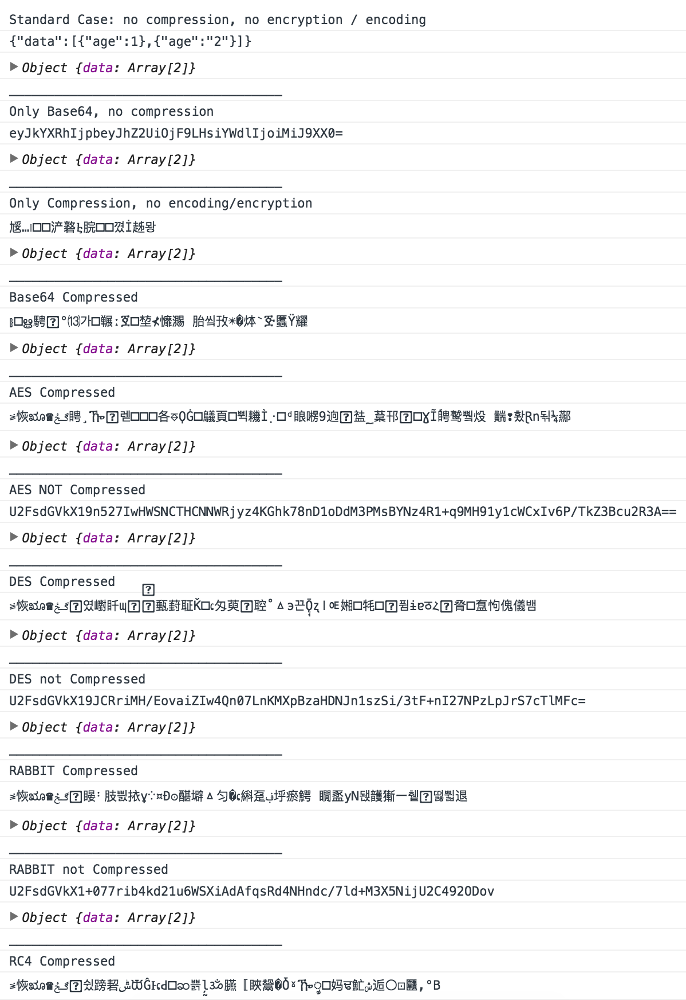

# secure-ls

Secure localStorage/sessionStorage data with high level of encryption and data compression.

[](https://www.npmjs.com/package/secure-ls) [](https://www.npmjs.com/package/secure-ls)

[](https://github.com/softvar/secure-ls/actions?query=workflow%3ACI)
[](https://codecov.io/gh/softvar/secure-ls)

**[LIVE DEMO](http://softvar.github.io/secure-ls#live-demo)**

## Features

- Secure data with various types of encryption including `AES`, `DES`, `Rabbit` and `RC4`. (defaults to `Base64` encoding).
- Compress data before storing it to `localStorage` to save extra bytes (defaults to `true`).
- Advanced API wrapper over `localStorage` API, providing other basic utilities.
- Save data in multiple keys inside `localStorage` and `secure-ls` will always remember it's creation.

## Installation

Via NPM

```bash
npm install secure-ls
```

Via yarn

```bash
yarn add secure-ls
```

## Libraries used

- **Encryption / Decryption** using [The Cipher Algorithms](https://code.google.com/archive/p/crypto-js)

  It requires secret-key for encrypting and decrypting data securely. If custom secret-key is provided as mentioned below in APIs, then the library will pick that otherwise it will generate yet another very `secure` unique password key using [PBKDF2](https://code.google.com/archive/p/crypto-js/#PBKDF2), which will be further used for future API requests.

  `PBKDF2` is a password-based key derivation function. In many applications of cryptography, user security is ultimately dependent on a password, and because a password usually can't be used directly as a cryptographic key, some processing is required.

  A salt provides a large set of keys for any given password, and an iteration count increases the cost of producing keys from a password, thereby also increasing the difficulty of attack.

  Eg: `55e8f5585789191d350329b9ebcf2b11` and `db51d35aad96610683d5a40a70b20c39`.

  For the generation of such strings, `secretPhrase` is being used and can be found in code easily but that won't make it unsecure, `PBKDF2`'s layer on top of that will handle security.

- **Compresion / Decompression** using [lz-string](https://github.com/pieroxy/lz-string)

## Usage

- Example 1: With `default` settings i.e. `Base64` Encoding and Data Compression

```javascript
const ls = new SecureLS();

ls.set('key1', { data: 'test' }); // set key1
ls.get('key1'); // print data
// {data: 'test'}
```

- Example 2: With `AES` Encryption and Data Compression

```javascript
const ls = new SecureLS({ encodingType: 'aes' });

ls.set('key1', { data: 'test' }); // set key1
ls.get('key1'); // print data
// {data: 'test'}

ls.set('key2', [1, 2, 3]); // set another key
ls.getAllKeys(); // get all keys
// ["key1", "key2"]
ls.removeAll(); // remove all keys
```

- Example 3: With `RC4` Encryption but no Data Compression

```javascript
const ls = new SecureLS({ encodingType: 'rc4', isCompression: false });

ls.set('key1', { data: 'test' }); // set key1
ls.get('key1'); // print data
// {data: 'test'}

ls.set('key2', [1, 2, 3]); // set another key
ls.getAllKeys(); // get all keys
// ["key1", "key2"]
ls.removeAll(); // remove all keys
```

- Example 3: With `DES` Encryption, no Data Compression and custom secret key

```javascript
const ls = new SecureLS({ encodingType: 'des', isCompression: false, encryptionSecret: 'my-secret-key' });

ls.set('key1', { data: 'test' }); // set key1
ls.get('key1'); // print data
// {data: 'test'}

ls.set('key2', [1, 2, 3]); // set another key
ls.getAllKeys(); // get all keys
// ["key1", "key2"]
ls.removeAll(); // remove all keys
```

## API Documentation

#### Create an instance / reference before using.

```javascript
const ls = new SecureLS();
```

`Contructor` accepts a configurable `Object` with all three keys being optional.

| Config Keys             | default      | accepts                                  |
| ----------------------- | ------------ | ---------------------------------------- |
| **encodingType**        | Base64       | `base64`/`aes`/`des`/`rabbit`/`rc4`/`''` |
| **isCompression**       | `true`       | `true`/`false`                           |
| **encryptionSecret**    | PBKDF2 value | String                                   |
| **encryptionNamespace** | null         | String                                   |

**Note:** `encryptionSecret` will only be used for the Encryption and Decryption of data
with `AES`, `DES`, `RC4`, `RABBIT`, and the library will discard it if no encoding / Base64
encoding method is choosen.

`encryptionNamespace` is used to make multiple instances with different `encryptionSecret`
and/or different `encryptionSecret` possible.

```javascript
const ls1 = new SecureLS({ encodingType: 'des', encryptionSecret: 'my-secret-key-1' });

const ls2 = new SecureLS({ encodingType: 'aes', encryptionSecret: 'my-secret-key-2' });
```

**Examples:**

- No config or empty Object i.e. Default **`Base64 Encoding`** and **`Data compression`**

```javascript
const ls = new SecureLS();
// or
const ls = new SecureLS({});
```

- No encoding No data compression i.e. **`Normal`** way of storing data

```javascript
const ls = new SecureLS({ encodingType: '', isCompression: false });
```

- **`Base64`** encoding but **`no`** data compression

```javascript
const ls = new SecureLS({ isCompression: false });
```

- **`AES`** encryption and **`data compression`**

```javascript
const ls = new SecureLS({ encodingType: 'aes' });
```

- **`RC4`** encryption and **`no`** data compression

```javascript
const ls = new SecureLS({ encodingType: 'rc4', isCompression: false });
```

- **`RABBIT`** encryption, **`no`** data compression and `custom` encryptionSecret

```javascript
const ls = new SecureLS({ encodingType: 'rc4', isCompression: false, encryptionSecret: 's3cr3tPa$$w0rd@123' });
```

#### Methods

- **`set`**

  Saves `data` in specifed `key` in localStorage. If the key is not provided, the library will warn. Following types of JavaScript objects are supported:

  - Array
  - ArrayBuffer
  - Blob
  - Float32Array
  - Float64Array
  - Int8Array
  - Int16Array
  - Int32Array
  - Number
  - Object
  - Uint8Array
  - Uint8ClampedArray
  - Uint16Array
  - Uint32Array
  - String

  | Parameter | Description          |
  | --------- | -------------------- |
  | key       | key to store data in |
  | data      | data to be stored    |

  ```javascript
  ls.set('key-name', { test: 'secure-ls' });
  ```

- **`get`**

  Gets `data` back from specified `key` from the localStorage library. If the key is not provided, the library will warn.

  | Parameter | Description                 |
  | --------- | --------------------------- |
  | key       | key in which data is stored |

  ```javascript
  ls.get('key-name');
  ```

- **`remove`**

  Removes the value of a key from the localStorage. If the `meta key`, which stores the list of keys, is tried to be removed even if there are other keys which were created by `secure-ls` library, the library will warn for the action.

  | Parameter | Description                        |
  | --------- | ---------------------------------- |
  | key       | remove key in which data is stored |

  ```javascript
  ls.remove('key-name');
  ```

- **`removeAll`**

  Removes all the keys that were created by the `secure-ls` library, even the `meta key`.

  ```javascript
  ls.removeAll();
  ```

- **`clear`**

  Removes all the keys ever created for that particular domain. Remember localStorage works differently for `http` and `https` protocol;

  ```javascript
  ls.clear();
  ```

- **`getAllKeys`**

  Gets the list of keys that were created using the `secure-ls` library. Helpful when data needs to be retrieved for all the keys or when keys name are not known(dynamically created keys).

  `getAllKeys()`

  ```javascript
  ls.getAllKeys();
  ```

## Screenshot



## Scripts

- `npm run build` - produces production version of the library under the `dist` folder
- `npm run build-dev` - produces development version of the library and runs a watcher
- `npm run test` - well ... it runs the tests :)

## Contributing

1. Fork the repo on GitHub.
2. Clone the repo on machine.
3. Execute `npm install` and `npm run dev`.
4. Create a new branch `<fix-typo>` and do your work.
5. Run `npm run build` to build dist files and `npm run test` to ensure all test cases are passing.
6. Commit your changes to the branch.
7. Submit a Pull request.

## Development Stack

- Webpack based `src` compilation & bundling and `dist` generation.
- ES6 as a source of writing code.
- Exports in a [umd](https://github.com/umdjs/umd) format so the library works everywhere.
- ES6 test setup with [Jest](https://jestjs.io/)
- Linting with [ESLint](http://eslint.org/).

## Process

```
ES6 source files
       |
       |
    webpack
       |
       +--- babel, eslint
       |
  ready to use
     library
  in umd format
```

## Credits

Many thanks to:

- [@brix](https://github.com/brix) for the awesome **[crypto-js](https://github.com/brix/crypto-js)** library for encrypting and decrypting data securely.

- [@pieroxy](https://github.com/pieroxy) for the **[lz-string](https://github.com/pieroxy/lz-string)** js library for data compression / decompression.

## Copyright and license

> The [MIT license](https://opensource.org/licenses/MIT) (MIT)
>
> Copyright (c) 2015-2024 Varun Malhotra
>
> Permission is hereby granted, free of charge, to any person obtaining a copy of this software and associated documentation files (the "Software"), to deal in the Software without restriction, including without limitation the rights to use, copy, modify, merge, publish, distribute, sublicense, and/or sell copies of the Software, and to permit persons to whom the Software is furnished to do so, subject to the following conditions:
>
> The above copyright notice and this permission notice shall be included in all copies or substantial portions of the Software.
>
> THE SOFTWARE IS PROVIDED "AS IS", WITHOUT WARRANTY OF ANY KIND, EXPRESS OR IMPLIED, INCLUDING BUT NOT LIMITED TO THE WARRANTIES OF MERCHANTABILITY, FITNESS FOR A PARTICULAR PURPOSE AND NONINFRINGEMENT. IN NO EVENT SHALL THE AUTHORS OR COPYRIGHT HOLDERS BE LIABLE FOR ANY CLAIM, DAMAGES OR OTHER LIABILITY, WHETHER IN AN ACTION OF CONTRACT, TORT OR OTHERWISE, ARISING FROM, OUT OF OR IN CONNECTION WITH THE SOFTWARE OR THE USE OR OTHER DEALINGS IN THE SOFTWARE.
